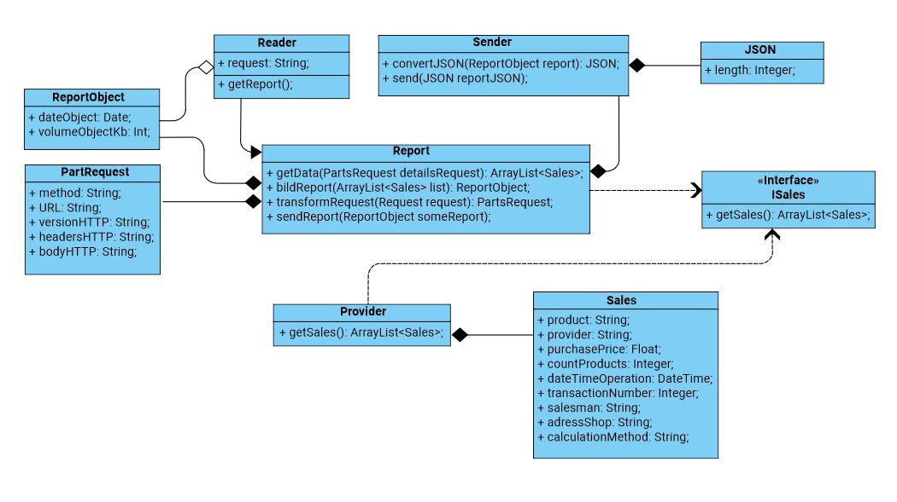
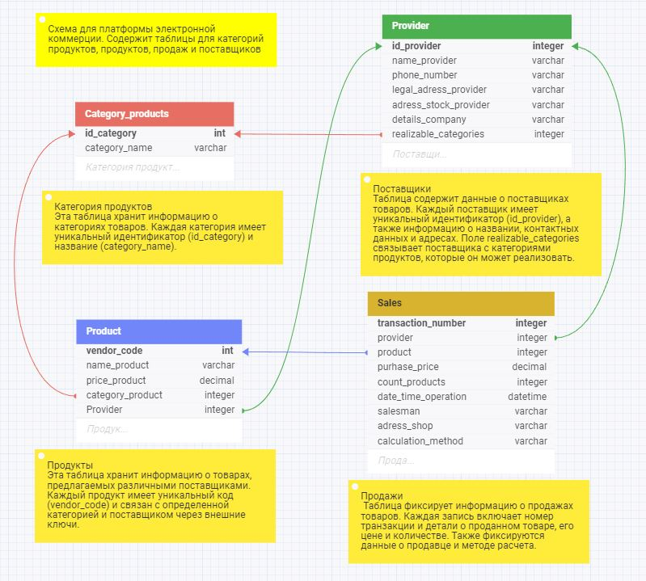
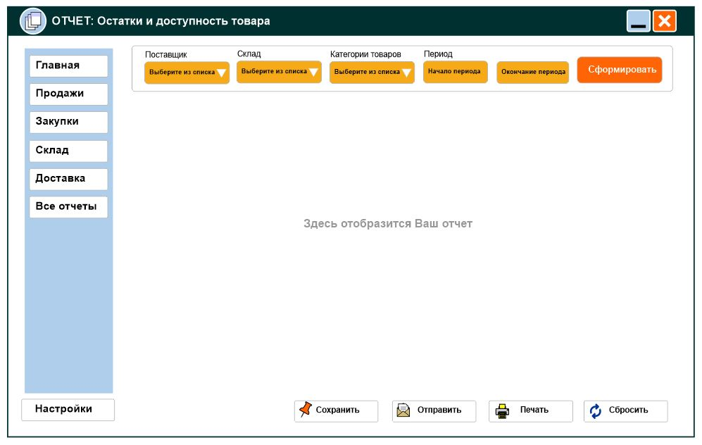

## Архитектура ПО

### Урок 7. Типа архитектур WEB-приложений: MPA, SPA

**Задани 1**. Доработать экранные формы интерфейса в https://www.figma.com/ или https://app.diagrams.net/.

**Задани 2**. Разработать полную ERD домена в https://www.dbdesigner.net/.

**Задани 3**. Разработать диаграмму компонент в UML включая слои пользовательского интерфейса и бизнес-логики.

### РЕШЕНИЕ:

1) UML

2) ERD

3) UI

