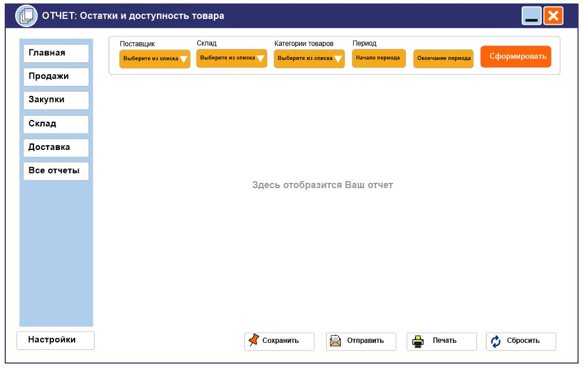

## Архитектура ПО

### Урок 7. Типы архитектур WEB-приложений: MPA, SPA

**Задание 1**. Доработать экранные формы интерфейса в https://www.figma.com/ или https://app.diagrams.net/.

**Задание 2**. Разработать полную ERD домена в https://www.dbdesigner.net/.

**Задание 3**. Разработать диаграмму компонент в UML включая слои пользовательского интерфейса и бизнес-логики.

### РЕШЕНИЕ:

1) UI - экранная форма пользовательского интерфейса

2) ERD-диаграмма домена 

3) UML-диаграмма компонент

